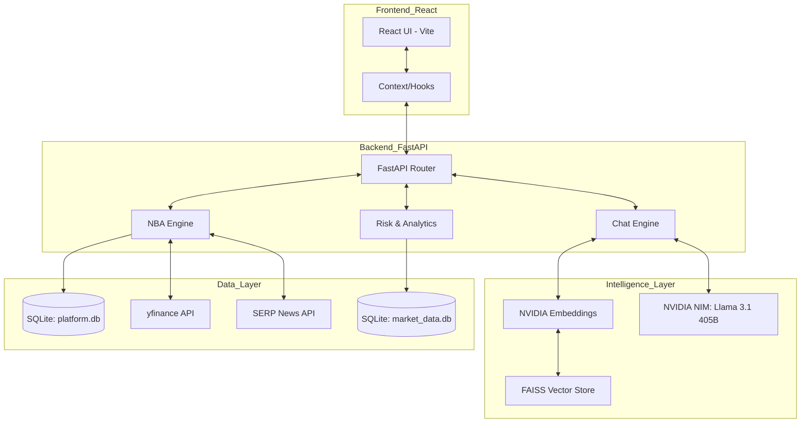

# Financial Intelligence & Next Best Action (NBA) Platform

## 🔗 Live Demo

**Frontend**: https://wealth-ai-zzfq.vercel.app/

---

An institutional-grade wealth management platform that combines quantitative finance with generative AI to provide personalized investment strategies and real-time market intelligence.

## 🏗️ Architecture

## 🚀 Key Features

- **AI Advisor Chat**: RAG-based assistant powered by NVIDIA NIM (Llama 3.1) for deep market analysis and portfolio-specific queries.
- **NBA Engine**: "Next Best Action" recommendation system that triggers buy/sell/hold suggestions based on market events and user risk profiles.
- **Portfolio Analytics**: Real-time tracking, correlation matrices, and sector exposure heatmaps.
- **Risk Management**: Monte Carlo simulations, stress testing, and GARCH/Prophet-based forecasting.
- **Market Intelligence**: Automated news classification and sector rotation tracking (Leading, Lagging, Improving, Weakening).
- **Onboarding**: Dynamic risk tolerance assessment and goal-based investment planning.

## 🛠️ Tech Stack

- **Backend**: FastAPI (Python), SQLite, FAISS (Vector DB)
- **Frontend**: React 19, Tailwind CSS, Vite, Recharts
- **AI/ML**: NVIDIA Cloud APIs, LangChain, OpenAI API
- **Data**: yfinance, Feedparser, Pandas, Scikit-learn

## 📦 Installation & Setup

### Prerequisites
- Python 3.10+
- Node.js & npm
- NVIDIA API Key

### Backend Setup
1. Clone the repository.
2. Create a virtual environment: `python -m venv venv`
3. Activate it: `venv\Scripts\activate` (Windows) or `source venv/bin/activate` (Mac/Linux)
4. Install dependencies: `pip install -r requirements.txt`
5. Set up your `.env` file (see `.env.example`).
6. Run the server: `uvicorn backend.main:app --reload`

### Frontend Setup
1. Navigate to the frontend folder: `cd frontend`
2. Install dependencies: `npm install`
3. Start the development server: `npm run dev`

## 📄 License

This project is licensed under the MIT License - see the [LICENSE](LICENSE) file for details.
